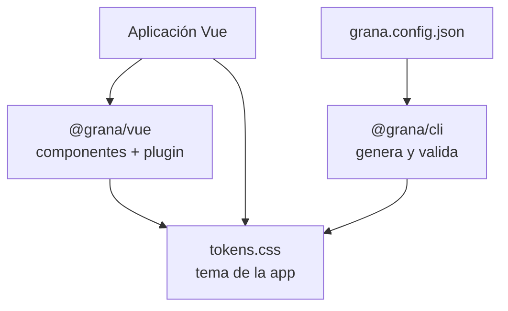

# Documentación de Grana

Grana es una biblioteca de interfaz para Vue 3. Aporta componentes con comportamiento y accesibilidad definidos; cada proyecto aporta su identidad mediante **tokens**. La intención es ofrecer una experiencia de consumo parecida a la de Vuetify —instalar, elegir un componente y consultar ejemplos— sin acoplar el diseño visual a una marca fija.

> Estado actual: **pre-alfa**. El código vive en un monorepo y los paquetes todavía no están publicados. Esta guía describe lo que está implementado en la rama actual; no es una promesa de estabilidad semántica hasta una versión 0.1.0.

## Empieza aquí

| Si necesitas… | Lee |
| --- | --- |
| Entender el producto, los paquetes y el modelo de tema | Este documento |\n| Saber si Grana encaja en tu producto o compararlo con Vuetify | [Posicionamiento](foundations/product-positioning.md) |
| Definir o validar la identidad visual de una aplicación | [Contrato de tokens](contract/tokens.md) |
| Ver reglas compartidas de la API | [Contrato de API](contract/api.md) |
| Usar o reemplazar iconos | [Contrato de iconos](contract/icons.md) |
| Configurar o automatizar el tema | [README de `@grana/cli`](../packages/cli/README.md) |
| Saber exactamente qué admite un componente | `packages/vue/src/components/<Componente>/README.md` |
| Conocer la intención de diseño antes de construir un componente | `design/contracts/<componente>.md` |

## Qué problema resuelve

Una librería de UI suele mezclar dos cosas:

1. comportamiento repetible: foco, teclado, estados, validación, overlays, jerarquía semántica;
2. apariencia de una marca: color, radio, tipografía, ritmo y superficies.

Grana los separa. Un componente no contiene valores visuales finales: consume `var(--g-*)`. El tema default entrega una apariencia lista para usar y `@grana/cli` puede generar un tema propio que valida mínimos de contraste, foco y legibilidad, en claro y oscuro.



Esto es el corazón de Grana: **la API y la accesibilidad son estables por componente; el look se configura como tema**.

## Paquetes

| Paquete | Responsabilidad | Entrada principal |
| --- | --- | --- |
| `@grana/vue` | Componentes Vue 3, CSS base, plugin y servicios de interfaz | `packages/vue/src/index.js` |
| `@grana/cli` | Genera `tokens.css`, valida el tema y ofrece integración con Vite | `packages/cli/` |

Requisitos actuales: Vue `^3.5` para `@grana/vue` y Node.js 20 o superior para el CLI.

## Uso de desarrollo local

Desde la raíz del monorepo:

```bash
npm install
npm run test
npm run build
```

Una vez publicado, el consumo esperado será:

```js
import { createApp } from 'vue'
import Grana, { GBtn } from '@grana/vue'
import '@grana/vue/style.css'

const app = createApp(App)
app.use(Grana) // registro global opcional
app.component('GBtn', GBtn) // alternativa: registro explícito
```

Con el plugin instalado se pueden usar los componentes registrados globalmente. También se exportan individualmente para registro local y mejor control del bundle.

## Catálogo de componentes

El catálogo público se deriva de las exportaciones de `@grana/vue`. La página de cada componente dentro de `packages/vue/src/components/` es la fuente de verdad para sus props, eventos, slots, accesibilidad y ejemplos.

| Área | Componentes disponibles |
| --- | --- |
| Acciones y superficies | `GBtn`, `GBadge`, `GCard`, `GSurface`, `GDivider` |
| Campos y formularios | `GInput`, `GTextarea`, `GSelect`, `GCheckbox`, `GCheckboxGroup`, `GSwitch`, `GInputGroup` y sus partes, `GFieldGroup`, `GErrorSummary`, `GForm`, `GFormSection`, `GFormLayout`, `GFormRow`, `GFormActions` |
| Fecha y calendario | `GDatePicker`, `GCalendar` |
| Navegación y flujo | `GSidebar`, `GMenu`, `GTabs`, `GTabPanel`, `GStepper`, `GPagination`, `GFilterBar` |
| Datos y estado | `GTable`, `GDataList`, `GMetric`, `GProgress` |
| Overlays y ayuda | `GDialog`, `GHelper`, `GHelperScope`, `GToaster` |
| Widgets y composición | `GWidget`, `GWidgetGrid`, `GWidgetGallery`, `GWidgetConfig`, `GAvatarMotion` |

### Servicios y composables

Además de componentes, el paquete expone:

- `createToaster`, `useToast` y `toasterKey` para avisos imperativos gestionados por la aplicación.
- `useFormField` y `formKey` para integrar campos de Grana o campos propios en un formulario.

## Tema

Un tema se describe con un objeto corto. El CLI deriva los valores que faltan y los valida antes de escribir CSS.

```json
{
  "brand": "#7A1F5C",
  "accent": "#0F766E",
  "radius": 12,
  "space": 4,
  "font": "Inter",
  "dark": true
}
```

```bash
npx @grana/cli check grana.config.json
npx @grana/cli theme grana.config.json
```

El resultado no sustituye las decisiones de contenido de la aplicación: colores de imágenes, nombres, mensajes y contraste de gráficos siguen siendo responsabilidad del producto.

## Arquitectura de la documentación

La documentación tiene dos niveles que no deben mezclarse:

| Nivel | Destinatario | Contenido |
| --- | --- | --- |
| **Pública / de consumo** | Persona que integra Grana en una app | instalación, ejemplos, catálogo, patrones, tema y migración |
| **Contrato y diseño** | Quien construye o mantiene Grana | tokens, API transversal, decisiones, contrato de cada componente, auditorías y pruebas |

El directorio `design/` guarda el proceso de diseño y `DECISIONS.md` conserva el porqué de las decisiones. No son la primera lectura de quien sólo quiere usar un botón o un formulario.

## Convención para cada página de componente

Para que Grana sea navegable como una librería madura, cada componente debe tener una página pública con este orden:

1. **Cuándo usarlo** y cuándo no.
2. **Ejemplo mínimo** que pueda copiarse.
3. **Variantes y estados**.
4. **API**: props, eventos, slots y `v-model`.
5. **Accesibilidad**: teclado, foco, roles y anuncios.
6. **Tema**: tokens que consume, sin exponer valores literales.
7. **Patrones relacionados** y errores frecuentes.
8. **Estado de estabilidad**: experimental, candidato o estable.

Los README existentes de componentes son la base de este contenido. La tarea pendiente no es volver a redactarlos desde cero: es agregarlos a una navegación y convertir los ejemplos verificables en la cara pública de la librería.

## Camino a una experiencia tipo Vuetify

La siguiente secuencia evita crear un sitio bonito que se desincronice del código:

1. **Congelar el inventario**: derivar el catálogo y estado desde `src/index.js` y los `*.meta.json`.
2. **Crear un sitio de documentación** (por ejemplo VitePress) dentro del monorepo, inicialmente con esta guía, instalación, tema y un índice de componentes.
3. **Generar o importar la API** desde los metadatos de cada componente; la API no se escribe dos veces.
4. **Añadir ejemplos ejecutables** reutilizando el playground y pruebas de interacción.
5. **Publicar el paquete y documentación versionados juntos**: cada release debe indicar cambios incompatibles y componentes experimentales.
6. **Añadir búsqueda, selector claro/oscuro y selector de tema** sólo después de que el contenido esencial sea navegable.

## Contribuir sin romper el contrato

El proceso interno asigna responsables a estructura, contrato, estilo, funcionalidad y documentación. Antes de introducir un componente o token:

- revisa `AGENTS.md` y el contrato global;
- no agregues colores, tamaños o valores de fallback dentro del componente: usa tokens `--g-*`;
- documenta únicamente comportamiento ya implementado y comprobado;
- ejecuta pruebas y build del workspace;
- registra la decisión que cambie el contrato o la API.

---

La referencia principal para una integración sigue siendo el código y las pruebas de la versión instalada. Esta página sirve como puerta de entrada: ordena lo que ya existe y deja claro qué documentación es de consumo y cuál es de mantenimiento.
