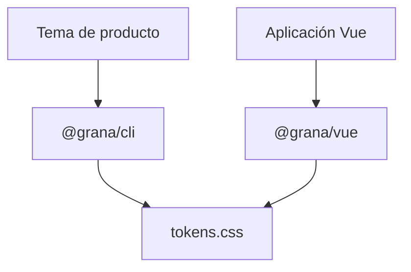

# Posicionamiento de Grana

## En una frase

**Grana es una biblioteca de componentes para Vue 3 que fija comportamiento y accesibilidad, pero deja que cada producto defina su propia identidad visual mediante tokens.**

No te impone un look. Te da una base consistente para construir el tuyo.

## Qué problema resuelve

Construir una interfaz de producto suele mezclar dos problemas distintos:

1. Hacer que los componentes se comporten bien: semántica, foco, teclado, validación, estados y overlays.
2. Hacer que toda la interfaz tenga una identidad coherente: color, tipografía, espaciado, radios y superficies.

Cuando ambos viven juntos dentro de cada componente, cambiar de marca o mantener consistencia entre equipos se vuelve costoso. Grana los separa:

- **Los componentes** contienen estructura, comportamiento y mínimos de accesibilidad.
- **Los tokens** concentran las decisiones visuales de un producto.
- **El CLI** genera el tema y valida que los cambios no rompan mínimos de contraste, foco y legibilidad.

## Para quién es

Grana está pensado inicialmente para equipos que:

- desarrollan productos Vue propios —SaaS, herramientas internas o plataformas con una marca definida;
- necesitan reutilizar interfaces entre proyectos sin obligarlos a verse iguales;
- valoran que accesibilidad y comportamiento se resuelvan una vez, no pantalla por pantalla;
- quieren centralizar decisiones visuales como una capa de tokens verificable.

## Cuándo elegir Grana

Elige Grana si la pregunta de tu equipo es:

> “¿Cómo mantenemos una experiencia consistente y accesible mientras cada producto conserva su identidad?”

Es una buena opción cuando tendrás más de una aplicación, más de una marca o una evolución visual esperada a lo largo del tiempo.

## Cuándo no elegirlo

Grana no pretende ser la mejor opción para todos los casos:

- Si necesitas una aplicación lista muy rápido y estás conforme con Material Design, un framework como Vuetify probablemente te llevará antes a producción.
- Si el proyecto es una maqueta, una landing muy pequeña o una interfaz de una sola pantalla, una librería completa puede ser más infraestructura de la necesaria.
- Si no habrá una capa de tema ni una intención de consistencia entre pantallas, los tokens no aportan suficiente valor todavía.

Esta decisión no es una limitación: aclara dónde Grana puede ser especialmente útil.

## Cómo se diferencia

<table header-row="true">
  <tr>
    <td>Enfoque</td>
    <td>Grana</td>
    <td>Vuetify</td>
  </tr>
  <tr>
    <td>Identidad visual</td>
    <td>La define cada producto mediante tokens.</td>
    <td>Parte de Material Design y su sistema visual.</td>
  </tr>
  <tr>
    <td>Valor principal</td>
    <td>Gobernanza de UI, accesibilidad y libertad de marca.</td>
    <td>Velocidad de implementación con una experiencia muy completa.</td>
  </tr>
  <tr>
    <td>Uso ideal</td>
    <td>Productos con identidad propia o design system en evolución.</td>
    <td>Aplicaciones que quieren adoptar una solución visual establecida.</td>
  </tr>
</table>

Grana puede inspirarse en la facilidad de descubrimiento de Vuetify sin copiar su lenguaje visual ni su API.

## Promesa y límites

### La promesa

- Una API de componentes clara y estable por versión.
- Componentes que consumen tokens, no valores visuales fijos.
- Mínimos de accesibilidad que no dependen del tema.
- Personalización centralizada y validable en claro y oscuro.

### Los límites

Grana no decide por la aplicación:

- el contenido, el tono ni la jerarquía de cada producto;
- el contraste de imágenes, gráficas o recursos externos;
- la estrategia de marca;
- el almacenamiento de preferencias de tema.

## Principios públicos

1. **Comportamiento antes que apariencia.** La interacción y la semántica se diseñan deliberadamente.
2. **Tokens antes que sobrescrituras.** La personalización ocurre en la capa de tema, no con CSS disperso.
3. **Accesibilidad no negociable.** El tema puede variar; los mínimos no.
4. **Documentar lo verificado.** La documentación pública describe lo que está implementado y probado.
5. **Progresión explícita.** Cada componente declarará si es draft, candidate o stable.

## Mensajes listos para usar

- **Corto:** “Grana da consistencia y accesibilidad a tus componentes Vue; tu producto conserva su propia identidad.”
- **Para el README:** “Componentes Vue 3 accesibles y tematizables por tokens. Grana fija el comportamiento; tu producto define el look.”
- **Para una presentación:** “Un sistema de UI para equipos Vue que necesitan libertad de marca sin reconstruir accesibilidad y consistencia en cada proyecto.”

## Siguiente paso

Con este posicionamiento aprobado, la siguiente entrega de la Fase 0 es convertir el README en el onboarding mínimo: qué es Grana, para quién es y cómo explorar lo que ya está disponible.
